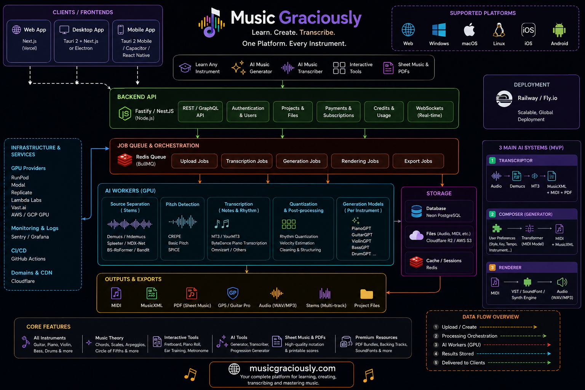

# Music Graciously

Music Graciously is an AI-focused music platform for learning, composing, generating, transcribing, editing, and exporting music through clean symbolic formats such as MIDI, MusicXML, score PDF, and rendered audio.

## Architecture article

The project includes a dedicated architecture page:

- Page: `/music-architecture`
- Purpose: explains the recommended technical roadmap for AI music transcription, symbolic generation, rendering, desktop/mobile apps, GPU workers, and export formats.

## Complete design image

The architecture page uses the complete Music Graciously design image below:



Image path in the repository:

```txt
public/assets/design/compelete-design-music-graciously.png
```

Public URL path inside the Next.js app:

```txt
/assets/design/compelete-design-music-graciously.png
```

This image is intentionally used as a key visual asset for the `/music-architecture` page and should remain available for the full-screen architecture viewer.

## Core stack

- Next.js frontend
- MUI interface components
- MusicXML, MIDI, PDF, GP5, and audio-focused product direction
- Planned AI pipeline with source separation, transcription, symbolic generation, rendering, and export workflows

## Product direction

Music Graciously is being shaped around three major AI music systems:

1. **Transcriptor** — audio to stems, notes, MIDI, MusicXML, and PDF.
2. **Composer** — user preferences to symbolic MIDI and MusicXML generation.
3. **Renderer** — MIDI to WAV, MP3, FLAC, or high-quality instrument playback.
